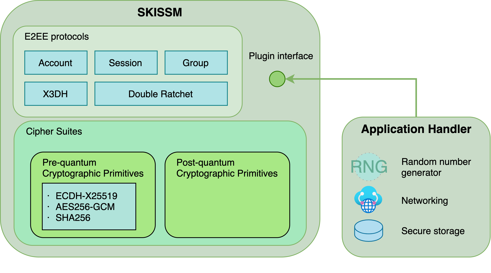

# Introduction

SKISSM implements the Signal protocol and aims to make it easy to build versatile end-to-end messaging applications. The two crucial security properties provided:

 - End-to-end encryption

   Only sender and recipient (and not even the server) can decrypt the content.

 - Forward secrecy

   Past sessions are protected against future compromises of keys or passwords.

SKISSM software architecture

<p align="center">
  
</p>

# Build

``` bash
mkdir build
cd build
cmake ..
make -j8
```

# Test

``` bash
cd build/tests
ctest
```

# Doc

[SLISSM Whitepaper](doc/skissm-whitepaper-v1.1.1.pdf)

# Licensing

SKISSM is available under two licenses:

 - GPLv3, for the growing ecosystem of Free and Open Source Software.

 - Commercial, for use in closed-source projects.

For commercial license without the source code conveying liability or any other questions,
please contact <ziv@citi.sinica.edu.tw>.